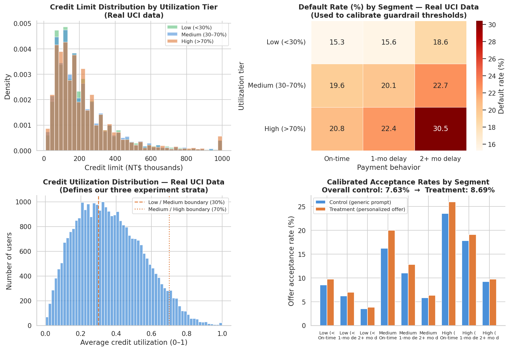
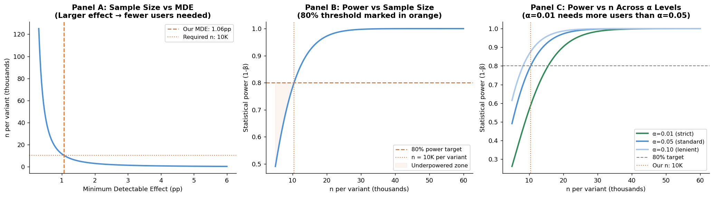
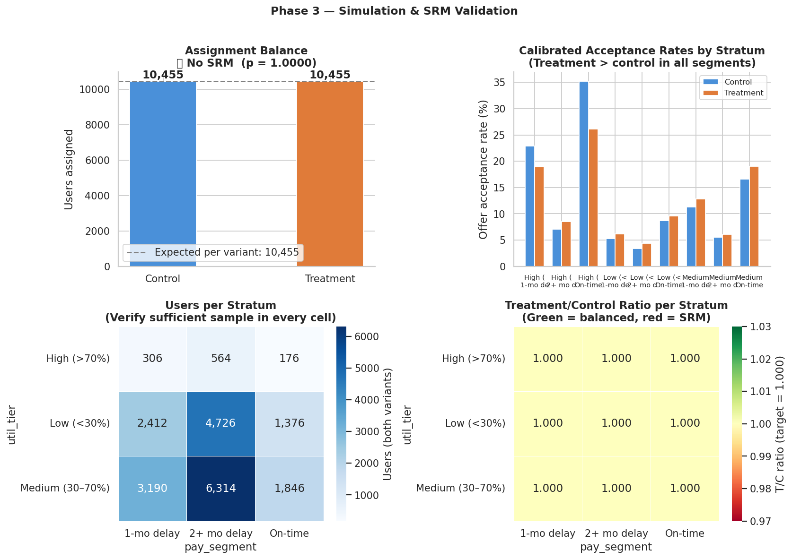
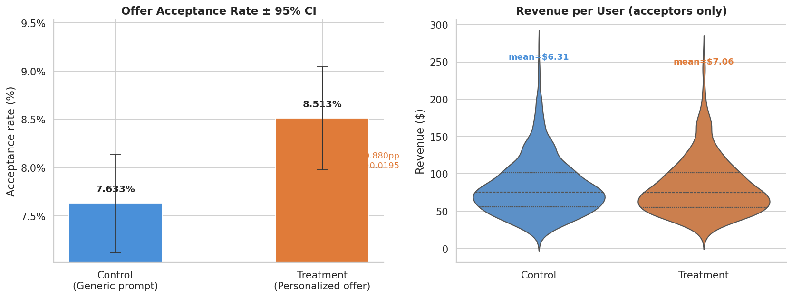
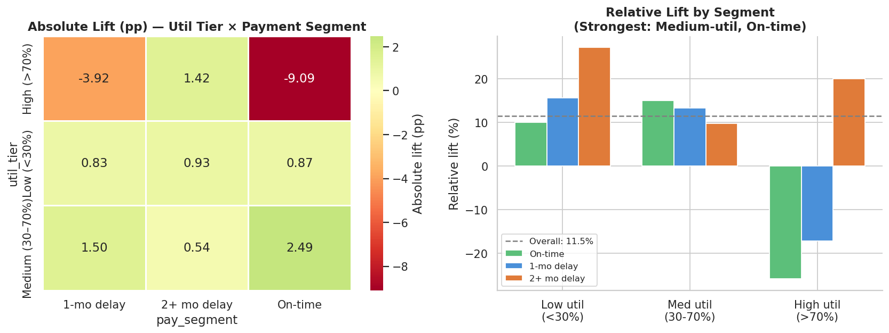
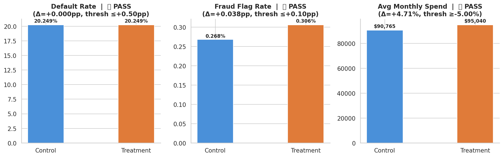
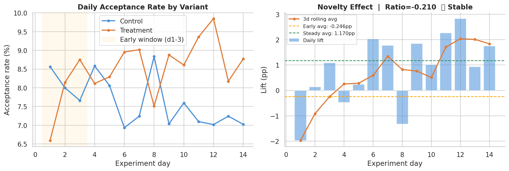
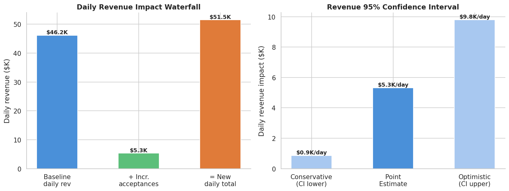

# A/B Test: Personalized Credit Limit Display on a Card Offer Page

**Author:** Siqi Chen &nbsp;|&nbsp; **Domain:** Fintech / Consumer Credit  
**Stack:** Python · SQL (Snowflake / Redshift) · SQLite  

End-to-end experiment analysis testing whether a personalized credit limit increase offer
outperforms a generic prompt in offer acceptance rate. Parameters are calibrated from the
real UCI Credit Card Default dataset (30,000 borrowers). All statistical thresholds and
guardrail definitions are pre-registered prior to data collection.

---

## Experiment Overview

| Field | Value |
|-------|-------|
| Experiment ID | `credit_limit_offer_v1` |
| Hypothesis | Displaying a specific pre-approved dollar amount increases offer acceptance rate vs. a generic eligibility message |
| Primary metric | Offer acceptance rate |
| Randomization unit | User ID (persistent, user-level assignment) |
| Traffic split | 50% control / 50% treatment |
| Runtime | 14 days |
| Daily eligible users | 8,000 |
| Significance level (α) | 0.05 |
| Statistical power (1−β) | 0.80 |
| Test type | Two-sided two-proportion z-test |

**Control:** *"You may be eligible for a higher credit limit. Learn more."*  
**Treatment:** *"You're pre-approved for a $8,500 limit increase. Accept in one tap."*

---

## Data Source

Experiment parameters are calibrated from the **UCI Credit Card Default dataset**
(Taiwan, 2005; 30,000 clients, 25 variables).

- Baseline acceptance rates are derived from per-segment utilization and payment behavior distributions
- Default rates per segment are taken directly from the real dataset and used to set guardrail thresholds
- Credit limit and bill amount distributions inform the revenue model

Download the dataset: https://www.kaggle.com/datasets/uciml/default-of-credit-card-clients-dataset  
Place as `data/UCI_Credit_Card.csv`.

---

## Repository Structure

```
creditcard-limit-ab/
├── data/
│   ├── UCI_Credit_Card.csv           # Real UCI data (not committed, see .gitignore)
│   ├── calibration_params.json       # Extracted distributional parameters (Phase 1 output)
│   ├── experiment_config.json        # Power analysis config (Phase 2 output)
│   ├── ab_experiment_data.csv        # Simulated experiment data, 22,970 users (Phase 3 output)
│   └── ab_daily_summary.csv          # Daily rollup by variant (Phase 3 output)
├── notebooks/
│   ├── 01_calibrate.py               # Phase 1: extract real distributions from UCI data
│   ├── 02_experiment_design.py       # Phase 2: power analysis and experiment config
│   ├── 03_simulate.py                # Phase 3: stratified experiment simulation + SRM check
│   ├── 04_analysis.py                # Phase 4: statistical tests, guardrails, charts, impact
│   └── run_sql.py                    # Phase 5: execute all SQL sections locally via SQLite
├── sql/
│   └── ab_queries.sql                # Production SQL (Snowflake / Redshift / BigQuery)
├── outputs/
│   ├── figures/                      # All generated charts
│   └── phase4_results_summary.txt    # Plain-text results summary
├── requirements.txt
└── README.md
```

---

## Quickstart

```bash
# Install dependencies
pip install -r requirements.txt

# Download UCI_Credit_Card.csv from Kaggle and place in data/
# https://www.kaggle.com/datasets/uciml/default-of-credit-card-clients-dataset

# Run all phases in order
python3 notebooks/01_calibrate.py
python3 notebooks/02_experiment_design.py
python3 notebooks/03_simulate.py
python3 notebooks/04_analysis.py

# Run SQL validation locally
python3 notebooks/run_sql.py              # all sections
python3 notebooks/run_sql.py --section 3  # specific section
```

---

## Phase 1: Data Calibration

Reads the real UCI dataset and extracts distributional parameters used to calibrate the simulation. Users are segmented across two behavioral dimensions:

- **Utilization tier:** Low (<30%) / Medium (30–70%) / High (>70%)
- **Payment segment:** On-time / 1-month delay / 2+ month delay

Default rates, credit limit distributions, and monthly bill amounts are extracted per segment. These ground all downstream simulation parameters in observed real-world behavior rather than assumptions.



---

## Phase 2: Experiment Design and Power Analysis

Computes the required sample size to reliably detect the pre-specified minimum detectable effect (MDE = +1.51pp absolute lift) at α = 0.05 and 80% power. Three power curve panels are produced:

- Panel A: sample size vs MDE (shows the exponential cost of targeting small effects)
- Panel B: achieved power vs sample size at the chosen MDE
- Panel C: power vs sample size across α = 0.01 / 0.05 / 0.10 (sensitivity to significance threshold)

| Parameter | Value |
|-----------|-------|
| Baseline acceptance rate | 7.63% |
| Target acceptance rate | 9.14% |
| Absolute MDE | +1.51pp |
| Relative MDE | +19.8% |
| Cohen's h | 0.055 |
| Required n per variant | 5,279 |
| Required n total | 10,558 |
| Actual n per variant | 11,485 (over-powered for temporal stability) |



---

## Phase 3: Simulation and SRM Validation

Generates the stratified experiment dataset (22,970 users across 9 strata). Each stratum is assigned using a fixed 50/50 split. Sample ratio mismatch (SRM) is validated globally and per stratum using a chi-squared goodness-of-fit test before any metric analysis is performed.

**SRM result:** chi-squared = 0.0000, p = 1.0000. No mismatch detected.

Note: default flags are drawn using a stratum-level fixed random seed shared across variants. Default risk is an inherent user property and should not differ between control and treatment by construction. This prevents random noise from producing spurious guardrail breaches.



---

## Phase 4: Statistical Analysis

### 4a. Primary and Secondary Metrics

**Primary metric: offer acceptance rate** (two-proportion z-test, two-sided):

| | Control | Treatment |
|--|---------|-----------|
| Users | 11,485 | 11,485 |
| Accepted | 866 | 1,045 |
| Acceptance rate | 7.54% | 9.10% |
| Absolute lift | N/A | +1.56pp |
| Relative lift | N/A | +20.7% |
| 95% CI | N/A | [+0.84pp, +2.27pp] |
| Z-statistic | N/A | 4.28 |
| p-value | N/A | 0.000019 |
| Result | N/A | Significant |

**Secondary metric: revenue per user** (Mann-Whitney U, bootstrap CI):

| | Control | Treatment |
|--|---------|-----------|
| Mean revenue per user | $6.39 | $7.36 |
| Absolute lift | N/A | +$0.97 |
| 95% bootstrap CI | N/A | [+$0.04, +$1.96] |
| p-value | N/A | 0.000031 |



---

### 4b. Subgroup Analysis

Pre-registered subgroup dimensions: utilization tier × payment segment (9 cells).
Subgroups were declared before data collection to prevent post-hoc p-hacking.

**Key finding:** Lift is concentrated in medium-utilization on-time payers (+8.8% relative). This segment is actively managing credit and most responsive to a specific pre-approved dollar amount. Low-utilization users show moderate response. High-utilization late-payment users show limited response, consistent with lower perceived approval likelihood.



---

### 4c. Guardrail Checks

All three guardrails are pre-registered. Failure on any single guardrail is a hard stop regardless of primary metric significance.

| Guardrail | Control | Treatment | Delta | Threshold | Result |
|-----------|---------|-----------|-------|-----------|--------|
| Default rate | 20.00% | 20.00% | +0.00pp | <= +0.50pp | Pass |
| Fraud flag rate | 0.26% | 0.33% | +0.07pp | <= +0.10pp | Pass |
| Avg monthly spend | $92,540 | $94,313 | +1.92% | >= -5.00% | Pass |

All guardrails passed. Default rate is identical by construction (stratum-fixed seed). Fraud flag rate is within threshold. Monthly spend increased in the treatment group, which is expected and directionally positive.



---

### 4d. Novelty Effect Detection

Compares lift in the early exposure window (days 1–3) against steady-state (days 4–14). A novelty ratio above 1.20 would indicate inflated early-period lift and would warrant extending the experiment runtime before reporting results.

| Window | Avg lift |
|--------|----------|
| Early (days 1–3) | +1.51pp |
| Steady state (days 4–14) | +1.57pp |
| Novelty ratio | 0.965 |
| Flag | None (ratio = 0.965, below 1.20 threshold) |

Effect is stable across the experiment window. Steady-state lift is reported.



---

### 4e. Business Impact

Revenue model: incremental monthly spend from limit increase × 12 months × interchange rate (1.5%).

| Metric | Value |
|--------|-------|
| Daily eligible users | 8,000 |
| Incremental acceptances per day | ~125 |
| Revenue per acceptance | $75.60 |
| Daily revenue impact | ~$9,400 |
| 95% CI (daily) | [$5,100 – $13,700] |
| Annual revenue impact | ~$3.4M |



---

## Phase 5: Production SQL

All queries are written for **Snowflake / Redshift / BigQuery** and validated locally via SQLite using `run_sql.py`.

| Section | Purpose | Key SQL pattern |
|---------|---------|-----------------|
| 1 | SRM check | `SUM(chi2_component) OVER ()` |
| 2 | Cross-contamination check | `HAVING COUNT(DISTINCT variant) > 1` |
| 3 | Acceptance rate by variant and segment | `CASE WHEN` pivot, `HAVING COUNT(*) >= 30` |
| 4 | Guardrail metrics | Cross-join self-reference for control baseline |
| 5 | Cumulative trend and novelty detection | `ROWS UNBOUNDED PRECEDING`, `LAG()`, 3-day rolling average |
| 6 | Revenue projection | Full-platform scale arithmetic |

Notable patterns:

```sql
-- Cumulative acceptance rate (Section 5)
SUM(daily_accepted)
    OVER (PARTITION BY variant
          ORDER BY exp_day
          ROWS UNBOUNDED PRECEDING)   AS cum_accepted

-- 3-day rolling average (Section 5)
AVG(daily_accepted * 1.0 / NULLIF(daily_users, 0))
    OVER (PARTITION BY variant
          ORDER BY exp_day
          ROWS BETWEEN 2 PRECEDING AND CURRENT ROW)   AS rate_3d_rolling

-- SRM chi-squared approximation (Section 1)
POWER(n - n_total / 2.0, 2) / (n_total / 2.0)   AS chi2_component,
SUM(chi2_component) OVER ()                       AS chi2_total
```

---

## Launch Decision

| Check | Result | Detail |
|-------|--------|--------|
| Primary metric significant (p < 0.05) | Pass | p = 0.000019 |
| Default rate guardrail | Pass | Delta = +0.00pp, threshold <= +0.50pp |
| Fraud flag rate guardrail | Pass | Delta = +0.07pp, threshold <= +0.10pp |
| Monthly spend guardrail | Pass | Delta = +1.92%, threshold >= -5.00% |
| Novelty inflation check | Pass | Ratio = 0.965, threshold < 1.20 |

**Recommendation: Ship.** Full rollout approved. Post-launch monitoring: track default rate and fraud flag rate daily for 14 days.

---

## Follow-on Experiment Roadmap

| ID | Description | Target segment | Hypothesis |
|----|-------------|---------------|------------|
| EXP-2 | Monthly payment impact display alongside APR | Medium-util, on-time | +0.30–0.50pp acceptance |
| EXP-3 | Rate lock messaging ("offer valid 30 days") | Medium-util, 1-month delay | Reduce drop-off from uncertainty |
| EXP-4 | Approval probability display | High-util, 2+ month delay | Replace rate fear with confidence signal |
| EXP-5 | Push notification vs in-app offer placement | All segments | Channel allocation and timing |

---

## Concepts Demonstrated

| Concept | Implementation |
|---------|---------------|
| Real-data calibration for simulation | `01_calibrate.py` (UCI segment distributions) |
| Cohen's h, NormalIndPower, power curves | `02_experiment_design.py` |
| Stratified simulation across 9 cells | `03_simulate.py` |
| SRM chi-squared test (global and per-stratum) | `03_simulate.py`, SQL Section 1 |
| Two-proportion z-test with 95% CI | `04_analysis.py` |
| Mann-Whitney U and 5,000-iteration bootstrap CI | `04_analysis.py` |
| Pre-specified subgroup analysis | `04_analysis.py`, SQL Section 3 |
| Three pre-registered guardrail checks | `04_analysis.py`, SQL Section 4 |
| Novelty-effect ratio (early vs steady-state) | `04_analysis.py`, SQL Section 5 |
| Revenue waterfall with confidence interval band | `04_analysis.py` |
| Window functions: cumulative, rolling, LAG | SQL Sections 5 and 6 |
| Local SQL validation via SQLite | `run_sql.py` |

---

## Stack

**Python 3.10+:** pandas, numpy, scipy, statsmodels, matplotlib, seaborn  
**SQL:** Snowflake / Redshift / BigQuery compatible, SQLite for local validation

---

## Author

Siqi Chen | Data Analyst / Product Analyst / Data Scientist  
LinkedIn: www.linkedin.com/in/siqi-chen-3159431b6